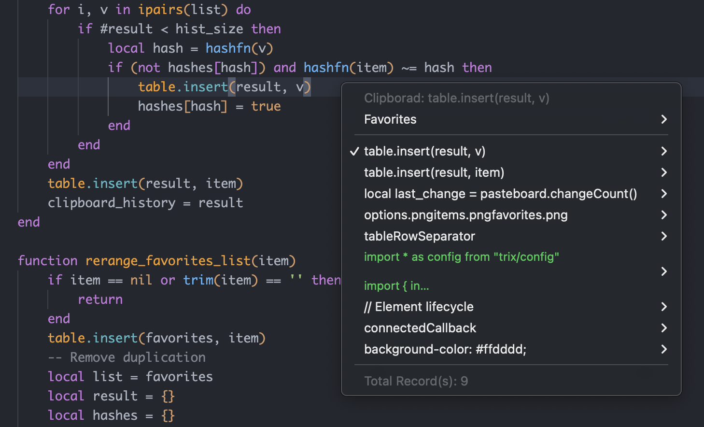
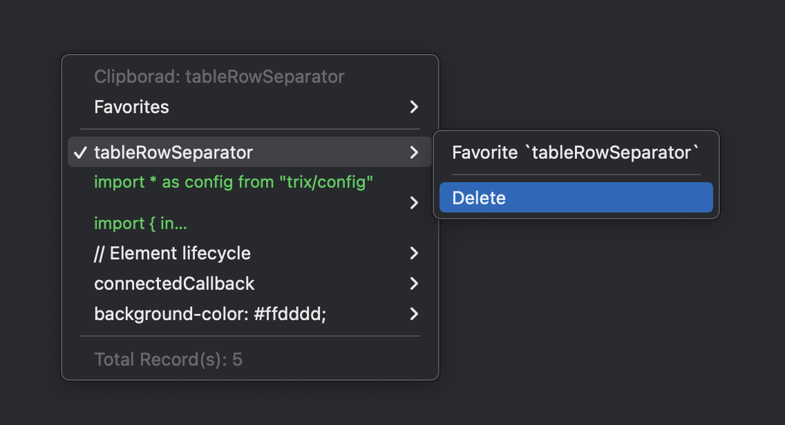
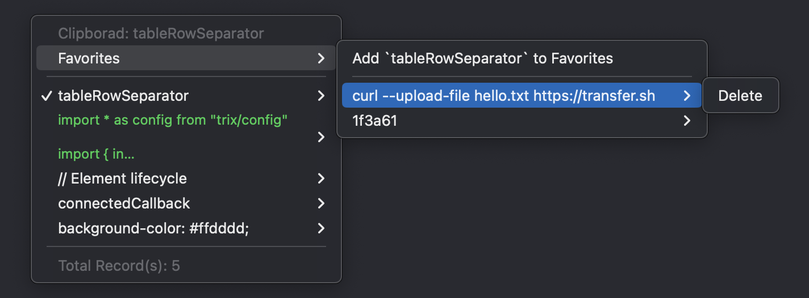
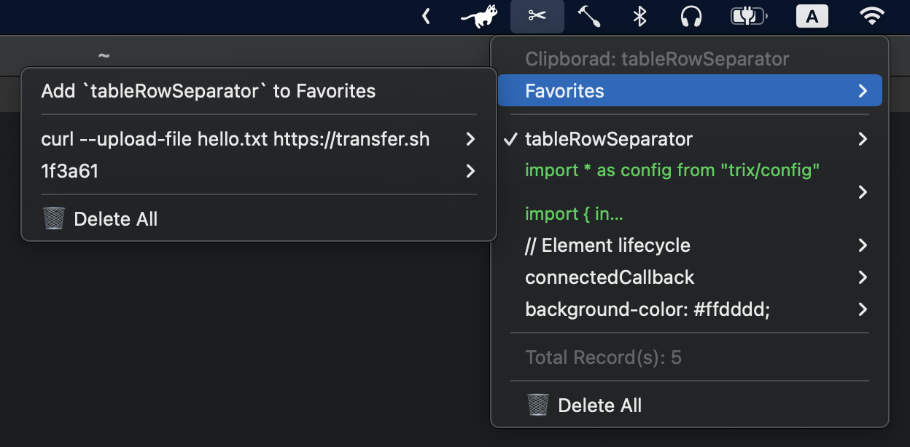

# Hammerspoon 功能配置文件

[Hammerspoon](http://www.hammerspoon.org/). 

## 使用方法

1. 安装 [Hammerspoon](http://www.hammerspoon.org/)

2. `git clone ... ~/.hammerspoon`

3. Hammerspoon 重新加载配置文件

## 功能列表

### 剪贴板
期望一个类型 win10 上的访问历史复制文本的功能，剪切板历史记录可支持**删除**、**收藏**

`cmd` + `shift` + `v` ：打开剪切板

选中历史项

收藏历史项

`option` + `点击菜单栏 ✂` 删除历史

### 窗口管理

`control` + `option` + `方向键` ：移动当前窗口 以半屏状态在四个方向移动

### 电池循环次数记录(WIP)

`control` + `option` + `b` ：显示电池状态信息